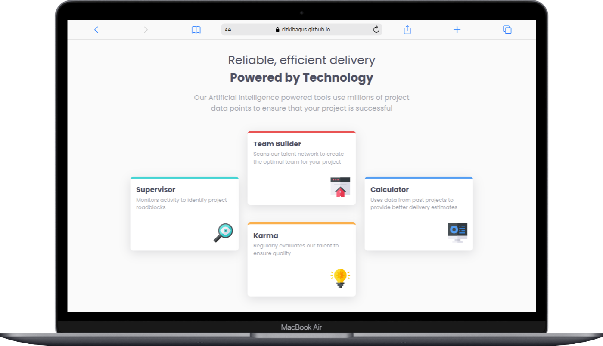
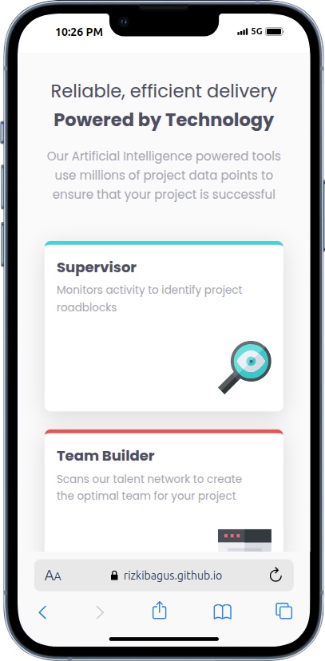

# Frontend Mentor - Four card feature section solution

This is a solution to the [Four card feature section challenge on Frontend Mentor](https://www.frontendmentor.io/challenges/four-card-feature-section-weK1eFYK). Frontend Mentor challenges help you improve your coding skills by building realistic projects. 

## Table of contents

- [Overview](#overview)
  - [The challenge](#the-challenge)
  - [Screenshot](#screenshot)
  - [Links](#links)
- [My process](#my-process)
  - [Built with](#built-with)
  - [What I learned](#what-i-learned)
- [Author](#author)

## Overview

### The challenge

Users should be able to:

- View the optimal layout for the site depending on their device's screen size

### Screenshot





### Links

- Solution URL: [Add solution URL here](https://github.com/rizkibagus/four-card-feature-section)
- Live Site URL: [Add live site URL here](https://rizkibagus.github.io/four-card-feature-section/)

## My process

### Built with

- Semantic HTML5 markup
- CSS custom properties
- Flexbox
- CSS Grid
- Mobile-first workflow

### What I learned

For the first time using grid, it's amazing.

To see how you can add code snippets, see below:

```html
 <section>
          <div class="card supervisor">
            <div class="card-description">
              <h3>Supervisor</h3>
              <p>Monitors activity to identify project roadblocks</p>
             </div>
            
          </div>
          <div class="card team-builder">
            <div class="card-description">
              <h3>Team Builder</h3>
              <p>
                Scans our talent network to create the optimal team for your
                project
              </p>
            </div>
            
          </div>
          <div class="card karma">
            <div class="card-description">
              <h3>Karma</h3>
              <p>Regularly evaluates our talent to ensure quality</p>
            </div>
            
          </div>
          <div class="card calculator">
            <div class="card-description">
              <h3>Calculator</h3>
              <p>
                Uses data from past projects to provide better delivery estimates
              </p>
            </div>
            
          </div>
        </section>
```
```css
@media (min-width: 768px) {
    
    .container main {
        padding: 1rem;
    }

    .container main section{
        display: grid;
        grid-template-columns: repeat(3, 1fr);
        grid-template-rows: repeat(2, auto);
        gap: 1.5rem;
        justify-content: center;
        align-items: center;
   
    }

    .container main section .card {
        width: 100%;
    }

    .container main section .supervisor{
        grid-column: 1; 
        grid-row: 1 / span 2;
        align-self: center;
    }

    .container main section .team-builder{
        grid-column: 2; 
        grid-row: 1;
    }

    .container main section .karma{
         grid-column: 2;
         grid-row: 2;
    }

    .container main section .calculator{
        grid-column: 3;
        grid-row: 1 / span 2;
        align-self: center;
    }

    .container main section .card img {
        width: 20%;
    }
}
```

## Author

- Website - [Rizki Bagus](https://github.com/rizkibagus)
- Frontend Mentor - [@rizkibagus](https://www.frontendmentor.io/profile/rizkibagus)
- Twitter - [@bagusdev_](https://www.twitter.com/bagusdev_)

